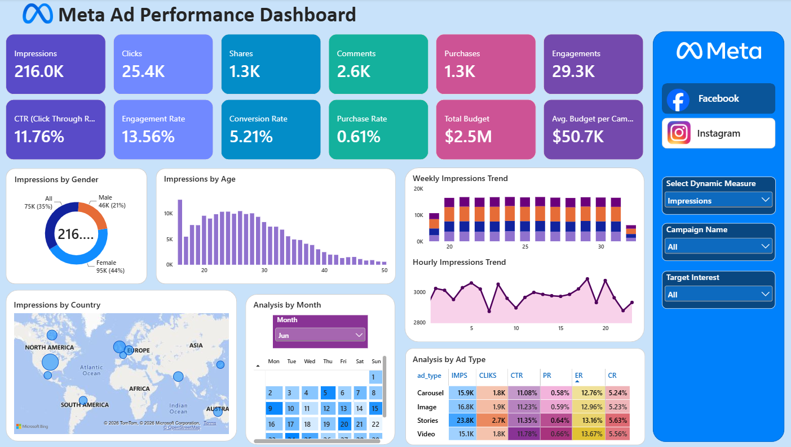
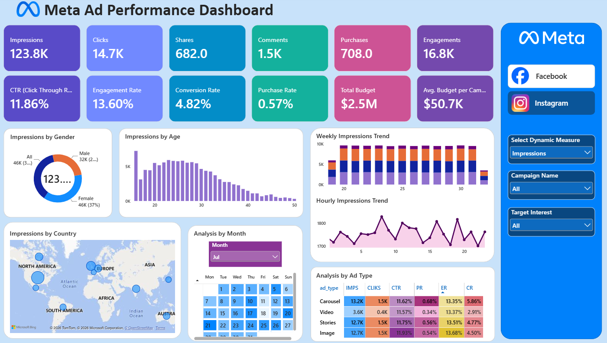

<div align="center">

# 📊 Meta Ad Performance Dashboard

## End-to-End Business Intelligence & Marketing Analytics Project

**Transforming 400,000+ multi-platform advertising event interactions into actionable marketing insights using Power BI, Power Query, Star Schema Data Modeling & DAX**


</div>

> **Note:** This project is built using a comprehensive Meta advertising performance dataset representing real-world digital marketing campaigns across Facebook and Instagram from **7 May 2025 to 6 August 2025**.

---

# 📊 Project Overview

This project presents an end-to-end Business Intelligence solution developed to evaluate, analyze, and optimize digital ad performance across Meta platforms (**Facebook & Instagram**).

The project covers the entire data lifecycle: from raw multi-table ingestion and Power Query ETL transformations to building an optimized dimensional Star Schema, calculating advanced DAX metrics, implementing dynamic measure selectors, and designing an interactive dual-view executive dashboard.

The dashboard delivers granular visibility into ad reach, funnel conversion drop-offs, demographic engagement patterns, ad creative effectiveness, and campaign budget utilization across 400,000 tracked interaction events.

---

# 💼 Business Problem

Modern digital marketing teams manage substantial paid media budgets across fragmented platforms and creative formats. Without granular performance visibility:
- Ad budgets are frequently exhausted on underperforming creatives and low-intent audience segments.
- Teams struggle to isolate top-of-funnel reach efficiency (CTR) from bottom-of-funnel purchase conversions (CR).
- Media buyers lack clear visibility into peak user engagement hours, leading to sub-optimal ad delivery scheduling and high ad fatigue.

This project delivers a centralized Business Intelligence solution to monitor volume metrics, conversion efficiency, creative fatigue, and audience behavior across **50 campaigns, 200 distinct ads, and 9,841 unique targeted users**.

---

# 🎯 Project Objectives

- Design an end-to-end Marketing Business Intelligence workflow in Power BI.
- Clean, profile, and transform multi-table transactional event logs using Power Query.
- Architect an optimized Star Schema data model for scalable analytical reporting.
- Formulate standardized DAX KPIs including CTR, Engagement Rate, Conversion Rate, and Purchase Rate.
- Implement **Dynamic Measure Selection** via DAX parameters to allow cross-visual metric exploration without visual clutter.
- Develop dedicated interactive dashboards for **Facebook** and **Instagram** performance.
- Extract data-backed recommendations to optimize paid ad spend and dayparting strategies.

---

# ⭐ Project Highlights

- Multi-Table Relational Architecture (Fact & Dimension Tables)
- Comprehensive Power Query Data Cleaning & Type Formatting
- Star Schema Dimensional Modeling
- Advanced DAX Ratios & Disconnected Slicer Parameters
- Dynamic Visual Titles & Automated Format Switching
- Granular Funnel Diagnostics (Impressions ➔ Clicks ➔ Engagements ➔ Purchases)
- Time-Intelligence Trends (Monthly, Weekly, and Hourly Dayparting Curves)
- Demographic & Geographic Segmentation (Age, Gender, Country)

---

# 🛠 Technology Stack

| Category | Technology |
|---|---|
| **Business Intelligence** | Microsoft Power BI Desktop |
| **ETL & Data Cleaning** | Power Query (M Language) |
| **Data Modeling** | Star Schema (1:N Single-Direction Relationships) |
| **Analytical Calculations** | Advanced DAX (Data Analysis Expressions) |
| **Data Sources** | Relational CSV Event Logs (400,000 Records) |

---

# 📂 Dataset Overview

The project utilizes a structured relational marketing dataset capturing user-level ad interactions and campaign metadata.

## Coverage Summary

| Attribute | Details |
|---|---|
| **Dataset Type** | Paid Advertising Interaction Event Logs |
| **Time Period** | 7 May 2025 – 6 August 2025 (Active 4 Months) |
| **Platforms Covered** | Facebook & Instagram |
| **Creative Formats** | Carousel, Image, Stories, Video |
| **Total Tracked Budget** | $2,535,923.78 (~$2.5M) |

## Dataset Statistics

| Dataset Table | Role | Records | Description |
|---|---|---:|---|
| **`ad_events`** | Fact Table | 400,000 | Granular events (Impressions, Clicks, Likes, Comments, Shares, Purchases) |
| **`campaigns`** | Dimension Table | 50 | Campaign metadata, start/end dates, duration, and allocated budgets |
| **`ads`** | Dimension Table | 200 | Creative ID, platform, ad type, and demographic targeting rules |
| **`users`** | Dimension Table | 9,841 | User demographic profiles, age, gender, country, and interest tags |

---

# 🔄 End-to-End Workflow

```text
Raw Marketing CSV Datasets (4 Tables)
                │
                ▼
Power Query ETL (Data Cleaning, Types, Handling Blanks)
                │
                ▼
Star Schema Data Model (1:N Relational Integrity)
                │
                ▼
DAX Measure Engineering & Dynamic Slicers
                │
                ▼
Interactive Multi-Page Power BI Dashboard
                │
                ▼
Executive Insights & Media Spend Recommendations
```

---

# 📈 Key Performance Indicators

The following quantified metrics summarize overall performance across the 400,000 event interactions:

| Metric | Facebook Performance | Instagram Performance | Combined / Overall |
|---|---:|---:|---:|
| **Total Impressions** | 215,972 (216.0K) | 123,840 (123.8K) | **339,812** |
| **Total Clicks** | 25,389 (25.4K) | 14,690 (14.7K) | **40,079** |
| **Total Purchases** | 1,323 (1.3K) | 708 (708.0) | **2,031** |
| **Total Engagements** | 29,296 (29.3K) | 16,848 (16.8K) | **46,144** |
| **Click-Through Rate (CTR)** | 11.76% | 11.86% | **11.79%** |
| **Engagement Rate (ER)** | 13.56% | 13.60% | **13.58%** |
| **Conversion Rate (CR)** | 5.21% | 4.82% | **5.07%** |
| **Purchase Rate (PR)** | 0.61% | 0.57% | **0.60%** |
| **Total Campaign Budget** | — | — | **$2.54M** |
| **Average Campaign Budget** | — | — | **$50.72K** |

---

# 📸 Dashboard Preview

## Facebook Performance Dashboard



Comprehensive dashboard page providing end-to-end visibility into Facebook ad spend, demographic distributions (Age & Gender), country-level reach, weekly/hourly performance trends, and ad format efficiency.

---

## Instagram Performance Dashboard



Dedicated Instagram analytics view highlighting comparative CTR, engagement metrics, format level diagnostics (Stories, Video, Carousel, Image), dynamic measure filtering, and hourly activity peaks.

---

# 💡 Key Business Insights

- **Platform Divergence:** Facebook acts as the core acquisition engine, driving **65.1% of total purchases (1,323)** with a superior **5.21% Conversion Rate**. Instagram functions as a high-intent discovery engine with a marginally higher **11.86% CTR**.
- **Ad Creative Hierarchy:** **Stories** and **Video** formats generate the highest sustained engagement and purchase rates across both platforms, whereas static Images show lower relative conversion elasticity.
- **Audience Concentration:** Over **60% of all ad conversions** stem from users aged **18–34**. Target audience responsiveness drops sharply past age 45, indicating significant ad spend leakage when targeting older brackets with broad creatives.
- **Temporal Patterns & Dayparting:** Interaction trends exhibit strong afternoon and late-evening peaks (12 PM – 3 PM and 7 PM – 10 PM), with activity dropping to near zero between 2 AM and 6 AM.

---

# 📌 Strategic Recommendations

- **Budget Reallocation:** Shift a higher proportion of direct-response conversion budgets to Facebook while leveraging Instagram primarily for Stories-driven top-of-funnel consideration.
- **Implement Dayparting (Ad Scheduling):** Restrict automated ad delivery between 2 AM and 6 AM to conserve budget and redeploy spend during peak engagement windows (afternoon and evening).
- **Format Modernization:** Transition lower-performing static single-image creatives into dynamic Carousel and short-form Video formats to improve overall CTR.
- **Audience Curation:** Restructure age targeting parameters to focus the majority of ad sets on the 18–34 demographic, utilizing tailored value propositions for niche older segments.

---

# 📁 Repository Structure

```text
Meta-Ad-Performance-Analysis/
│
├── 📂 Dashboard/
│   └── Meta Ad Performance Analysis.pbix
│       • Interactive Power BI report with dynamic measures and dual platform views
│
├── 📂 Raw Data/
│   ├── ad_events.csv        • 400,000 granular ad interaction logs
│   ├── ads.csv              • 200 ad creative records and targeting criteria
│   ├── campaigns.csv        • 50 campaign schedules and budget allocations
│   └── users.csv            • 9,841 demographic user profiles
│
├── 📂 Images/
│   ├── 01_Facebook_Performance.png
│   ├── 02_Instagram_Performance.png
│   ├── Facebook_Logo_2023.png
│   └── Instagram_icon.png
│       • High-resolution dashboard screenshots and platform assets
│
└── README.md
    • Comprehensive project documentation
```

---

# ▶️ Getting Started

1. Clone this repository:
   ```bash
   git clone [https://github.com/](https://github.com/)<your-username>/Meta-Ad-Performance-Analysis.git
   ```
2. Open `Meta Ad Performance Analysis.pbix` using **Microsoft Power BI Desktop**.
3. If prompted to update data source paths:
   - Navigate to **Home** > **Transform Data** > **Data source settings**.
   - Select **Change Source...** and browse to the corresponding CSV files in the `Raw Data/` folder.
   - Click **Apply Changes**.
4. Explore the interactive visuals, dynamic measure slicers, and platform toggles.

---

# 🔮 Future Enhancements

- Integrate daily granular spend data to calculate dynamic **Cost Per Click (CPC)**, **Cost Per Acquisition (CPA)**, and **Return on Ad Spend (ROAS)**.
- Implement Multi-Touch Attribution (MTA) modeling across cross-platform user journeys.
- Connect live Meta Marketing Graph APIs for automated daily pipeline refreshes.
- Build automated anomaly detection alerts for sudden CTR drops or ad fatigue.

---

# 👨‍💻 Author

**Vasu Bhardwaj**

**Aspiring Data Analyst | Power BI | DAX | SQL | Data Modeling | Business Intelligence**

---

# ⭐ Support

If you found this project valuable or learned something from it, please consider giving this repository a **⭐ Star**. Your support helps increase the visibility of the project and motivates continued development of high-quality data analytics projects.

---

<div align="center">

### ⭐ If you found this project helpful, consider giving it a Star!

**Built with ❤️ by Vasu Bhardwaj**

</div>
